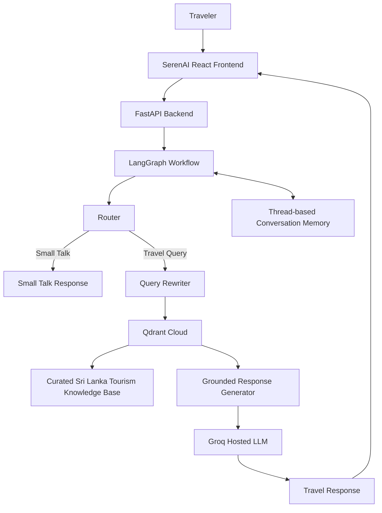

# 🇱🇰 SerenAI — Conversational RAG Travel Assistant

**SerenAI** is a stateful conversational AI travel assistant designed for Sri Lanka tourism.

It combines **Retrieval-Augmented Generation (RAG)**, contextual query rewriting, semantic search, conversational memory, and a curated Sri Lanka tourism knowledge base to provide grounded travel-planning assistance across multi-turn conversations.

SerenAI is developed as part of the **Serendib Routes** tourism technology initiative.

---

## 🌐 Live Demo

### 👉 [Try SerenAI](https://serendib-routes-ai-frontend.vercel.app/)

### 🔗 Backend Repository
[GitHub — Serendib Routes Conversational RAG](https://github.com/JustaNoobie1/serendib-routes-conversational-rag)

### 🔗 Frontend Repository
[GitHub - Serendib Routes AI Frontend](https://github.com/JustaNoobie1/serendib-routes-ai-frontend)

### 📡 API Documentation
[FastAPI Swagger Docs](https://serendib-routes-conversational-rag-production.up.railway.app/docs)

---

## ✨ Key Features

- 💬 Multi-turn conversational travel planning
- 🧠 Thread-based conversational memory
- 🔄 Context-aware query rewriting
- 🔍 Semantic retrieval using Qdrant Cloud
- 🇱🇰 Curated Sri Lanka tourism knowledge base
- 🛡️ Grounding safeguards for travel information
- 🧭 Small-talk and travel-query routing with LangGraph
- 📋 Markdown itinerary and table generation
- 👥 Isolated conversation sessions using unique thread IDs
- ⚡ FastAPI REST backend
- ⚛️ Responsive React + Vite frontend
- ☁️ Fully cloud-deployed architecture

---

## 🧠 System Architecture



### Cloud Deployment

```text
Traveler
   │
   ▼
React + Vite
Vercel
   │
   │ HTTPS
   ▼
FastAPI
Railway
   │
   ▼
LangGraph
 ┌───────────────┐
 │               │
 ▼               ▼
Qdrant Cloud    Groq
Vector DB        LLM
 │
 ▼
Sri Lanka
Tourism KB
```

---

## 🔄 LangGraph Workflow

The conversational workflow is orchestrated with **LangGraph**.

```text
START
  │
  ▼
Router
 ├────────────────────┐
 │                    │
 ▼                    ▼
Small Talk        Travel Query
 │                    │
 ▼                    ▼
END              Query Rewriter
                      │
                      ▼
                   Retrieve
                      │
                      ▼
                   Generate
                      │
                      ▼
                     END
```

The router determines whether the user is making a simple conversational request or asking a tourism-related question that requires retrieval.

---

## 🔄 Contextual Query Rewriting

Short follow-up questions often do not contain enough information for vector retrieval.

For example:

```text
Traveler:
"I want to plan a luxury honeymoon in Sri Lanka."

Follow-up:
"What about 7 days?"
```

The query rewriting stage uses previous conversation context to transform the follow-up into a standalone retrieval query:

```text
"7-day luxury honeymoon itinerary in Sri Lanka"
```

This improves semantic retrieval while allowing users to communicate naturally.

---

## 🔎 Retrieval-Augmented Generation

SerenAI uses a RAG pipeline instead of relying only on the LLM's internal knowledge.

```text
Traveler Message
       │
       ▼
Contextual Query Rewriting
       │
       ▼
Embedding Generation
       │
       ▼
Qdrant Semantic Search
       │
       ▼
Relevant Tourism Documents
       │
       ▼
Grounded Prompt
       │
       ▼
Hosted LLM
       │
       ▼
Traveler Response
```

### Embedding Model

The current embedding model is:

```text
sentence-transformers/all-MiniLM-L6-v2
```

The embeddings are stored and searched using **Qdrant Cloud**.

---

## 🗂️ Tourism Knowledge Base

The curated knowledge base currently contains information covering areas such as:

- Sri Lanka destinations
- Sample itineraries
- Cultural tourism
- Hill-country travel
- Southern-coast travel
- Honeymoon and luxury travel
- Accommodation guidance
- Budget frameworks
- Traveler preference collection
- Trip-planning guidance
- Cost-reduction strategies

The knowledge base is designed to be expanded incrementally as additional travel scenarios and destinations are added.

---

## 💬 Conversational Memory

Each conversation is assigned a unique `thread_id`.

Example:

```text
Traveler A
thread_id = abc123

Traveler B
thread_id = xyz789
```

This prevents conversations from sharing the same LangGraph state.

The React frontend stores the active conversation identifier using browser session storage.

Selecting **New conversation** creates a fresh thread, allowing the traveler to begin with a clean conversational context.

### Example Multi-Turn Interaction

```text
Traveler:
Plan my honeymoon trip.

SerenAI:
What duration are you considering?

Traveler:
What about 7 days?

SerenAI:
[Uses the previous honeymoon context]

Traveler:
How much will it cost?

SerenAI:
[Preserves the trip duration and previous preferences]
```

---

## 🛡️ Grounding and Hallucination Mitigation

The system prompt instructs SerenAI to prioritize retrieved tourism information rather than invent unsupported travel facts.

Extra care is applied to:

- Pricing
- Hotel information
- Supplier information
- Availability
- Travel policies
- Trip duration
- Traveler constraints
- Dynamic tourism information

When sufficient information is unavailable, SerenAI is designed to ask for clarification or acknowledge the limitation instead of confidently fabricating details.

---

## 🛠️ Tech Stack

### AI / Backend

| Technology | Purpose |
|---|---|
| Python | Core backend language |
| LangChain | LLM and RAG components |
| LangGraph | Conversational workflow orchestration |
| FastAPI | REST API |
| Qdrant Cloud | Vector database |
| Hugging Face Sentence Transformers | Embeddings |
| Groq | Hosted LLM inference |
| GPT-OSS | Response generation |

### Frontend

| Technology | Purpose |
|---|---|
| React | Chat interface |
| Vite | Frontend build tooling |
| React Markdown | Rendering AI Markdown responses |
| Session Storage | Client-side conversation persistence |

### Deployment

| Service | Purpose |
|---|---|
| Vercel | Frontend hosting |
| Railway | FastAPI backend hosting |
| Qdrant Cloud | Cloud vector storage |
| GitHub | Source control |

---

## 📡 API

### `POST /chat`

Sends a traveler message to SerenAI.

### Example Request

```json
{
  "message": "Plan a 7 day trip to Sri Lanka",
  "thread_id": "optional-conversation-id"
}
```

### Example Response

```json
{
  "answer": "Generated travel response...",
  "thread_id": "conversation-uuid"
}
```

The same `thread_id` can be passed with later requests to preserve conversational state.

---

## ⚙️ Local Development

### 1. Clone the repository

```bash
git clone https://github.com/JustaNoobie1/serendib-routes-conversational-rag.git
cd serendib-routes-conversational-rag
```

### 2. Create a virtual environment

```bash
python -m venv .venv
```

Activate it on Windows:

```powershell
.venv\Scripts\activate
```

### 3. Install dependencies

Install the dependencies defined by the project.

### 4. Configure environment variables

Create a local `.env` file.

Example:

```env
GROQ_API_KEY=
GROQ_MODEL=openai/gpt-oss-120b

QDRANT_MODE=cloud
QDRANT_URL=
QDRANT_API_KEY=
QDRANT_COLLECTION=serendib_routes
```

> Never commit real API keys or the `.env` file to GitHub.

### 5. Start the backend

```bash
uvicorn src.main:app --reload
```

Then open:

```text
http://localhost:8000/docs
```

---

## 🚀 Production Deployment

### Frontend

The SerenAI React application is deployed using **Vercel**:

https://serendib-routes-ai-frontend.vercel.app/

### Backend

The FastAPI application is hosted using **Railway**.

### Vector Database

The tourism embeddings are stored in **Qdrant Cloud**.

### LLM

Generation is handled using a hosted LLM through **Groq**, keeping model inference outside the browser and protecting private API credentials.

---

## 🔐 Security

Secrets such as:

- Groq API keys
- Qdrant API keys
- Qdrant cluster URLs

are stored as backend environment variables.

No private LLM or vector-database credentials are exposed to the React frontend.

Production CORS configuration restricts browser access to approved frontend origins.

---

## ⚠️ Current Limitations

SerenAI is currently a portfolio/MVP implementation.

Current limitations include:

- The tourism knowledge base covers a selected subset of Sri Lanka travel scenarios.
- Some highly specific itinerary requests do not yet have sufficient knowledge-base coverage.
- Current hotel prices and supplier availability require external verification.
- Weather and live tourism conditions are not currently retrieved in real time.
- Conversation state currently uses an in-memory LangGraph checkpointer.
- Conversation state may therefore reset after a backend restart.
- Live hotel booking is not currently integrated.
- Payment processing is not currently integrated.

---

## 🔮 Future Improvements

Planned improvements include:

- Expanded Sri Lanka tourism knowledge base
- Metadata-aware retrieval
- Duration-aware itinerary filtering
- Region-aware retrieval
- Persistent conversation storage
- Real-time weather integration
- Hotel and activity APIs
- Live availability and pricing
- Human-agent escalation
- Booking workflows
- Payment integration
- RAG evaluation pipeline
- Retrieval quality monitoring
- More advanced agentic travel-planning workflows

---

## 📸 Screenshots

Recommended screenshots:

1. SerenAI welcome screen
2. Multi-turn travel-planning conversation
3. Generated itinerary table
4. Mobile interface

---

## 🎯 Project Goal

SerenAI was built to explore how modern **Generative AI**, **Retrieval-Augmented Generation**, and conversational orchestration can be applied to tourism and hospitality.

The project demonstrates an end-to-end GenAI development lifecycle:

```text
Knowledge Base
      ↓
Embeddings
      ↓
Vector Search
      ↓
RAG Pipeline
      ↓
LangGraph Orchestration
      ↓
FastAPI
      ↓
React Interface
      ↓
Cloud Deployment
```

Rather than building only a local chatbot prototype, the goal was to develop and deploy a complete conversational AI application that can be accessed and tested publicly.

---

## 👨‍💻 Author

**Thimantha Sasindu**

Built as an AI engineering portfolio project focused on practical applications of Generative AI, RAG, and conversational systems.

---

## 🌐 Try SerenAI

### 👉 https://serendib-routes-ai-frontend.vercel.app/

Built with 🇱🇰 for Sri Lanka tourism.
